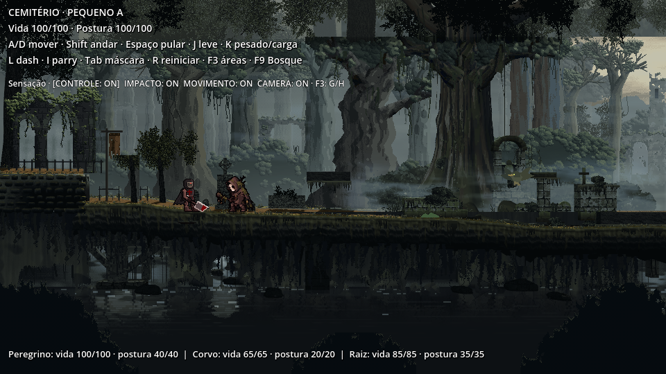

# Evidências — Peregrino Corrompido (4.7)

## Jogo real

[Clipe de 20 s](CLIPE_PEREGRINO_CORROMPIDO_20s.mp4) — 960×540, 30 fps; entradas programadas com IA/dano reais. Física, vida e tuning originais. Hitstop convertido em ticks de 60 Hz apenas durante a exportação.

## GIFs ×4

Todas as animações isoladas sobre cinza neutro; o pacote mantém sombra em arquivo separado.

- [alerta_x4](gifs_x4/alerta_x4.gif)
- [ataque_corte_duplo_x4](gifs_x4/ataque_corte_duplo_x4.gif)
- [ataque_corte_x4](gifs_x4/ataque_corte_x4.gif)
- [ataque_estocada_x4](gifs_x4/ataque_estocada_x4.gif)
- [ataque_investida_x4](gifs_x4/ataque_investida_x4.gif)
- [ataque_penitencia_x4](gifs_x4/ataque_penitencia_x4.gif)
- [dano_x4](gifs_x4/dano_x4.gif)
- [idle_x4](gifs_x4/idle_x4.gif)
- [morte_x4](gifs_x4/morte_x4.gif)
- [patrulha_x4](gifs_x4/patrulha_x4.gif)
- [perseguicao_x4](gifs_x4/perseguicao_x4.gif)
- [ruptura_x4](gifs_x4/ruptura_x4.gif)

## Áreas e poses na sala

F3: seis prints para os cinco golpes, incluindo as duas partes do duplo. Cápsula em ciano; áreas ACTIVE em roxo. As fotos congelam os atores para inspecionar os ataques originais; ruptura/morte nas fotos usam callbacks de dano. O clipe usa combate real.

- [corte F3](capturas/F3_corte.png) · [aviso](capturas/aviso_corte.png)
- [estocada F3](capturas/F3_estocada.png) · [aviso](capturas/aviso_estocada.png)
- [corte_duplo_1 F3](capturas/F3_corte_duplo_1.png) · [aviso](capturas/aviso_corte_duplo_1.png)
- [corte_duplo_2 F3](capturas/F3_corte_duplo_2.png) · [aviso](capturas/aviso_corte_duplo_2.png)
- [investida F3](capturas/F3_investida.png) · [aviso](capturas/aviso_investida.png)
- [penitencia F3](capturas/F3_penitencia.png) · [aviso](capturas/aviso_penitencia.png)

[Ruptura ×1](capturas/ruptura_x1.png) · [Morte ×1](capturas/morte_x1.png)

Limpeza, partes/pivôs, poses e comparações ao lado do Carrasco em `arte_fonte/peregrino_corrompido_v1/`.
